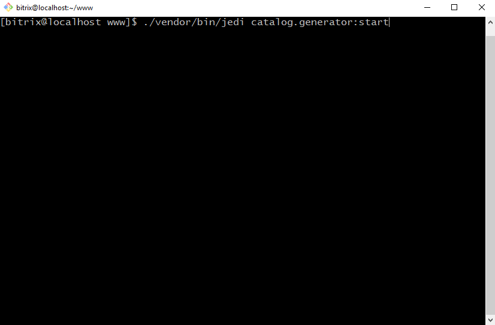

# Генератор тестового каталога

## Установка
```bash
composer require maaaxim/catalog.generator
```

## Использование
* Настройка модуля /bitrix/admin/settings.php?lang=ru&mid=catalog.generator&mid_menu=1
* Запуск /bitrix/admin/catalog_generator_controller.php

## Либо запуск через консоль
```bash
cd /home/bitrix/www
./vendor/bin/jedi init
./vendor/bin/jedi catalog.generator:start
```


## Задача модуля
### Сгенерировать тестовый каталог

## Возможности
* Генерация разделов, товаров и торговыми предложениями с полями, свойствами, ценами, складами
* Настройка количества каждой из сущностей
* Нужны ли у товаров тоговые предложения

## Зачем это вообще?
* Для нагрузочного тестирования архитектурных решений на битриксе
* Если нужно начать разработку, а контента пока нет и руками создавать не хочется

## @TODO
* Картинки сделать у sku, а не у товаров, если есть sku
* Разбить настройки на вкладки
